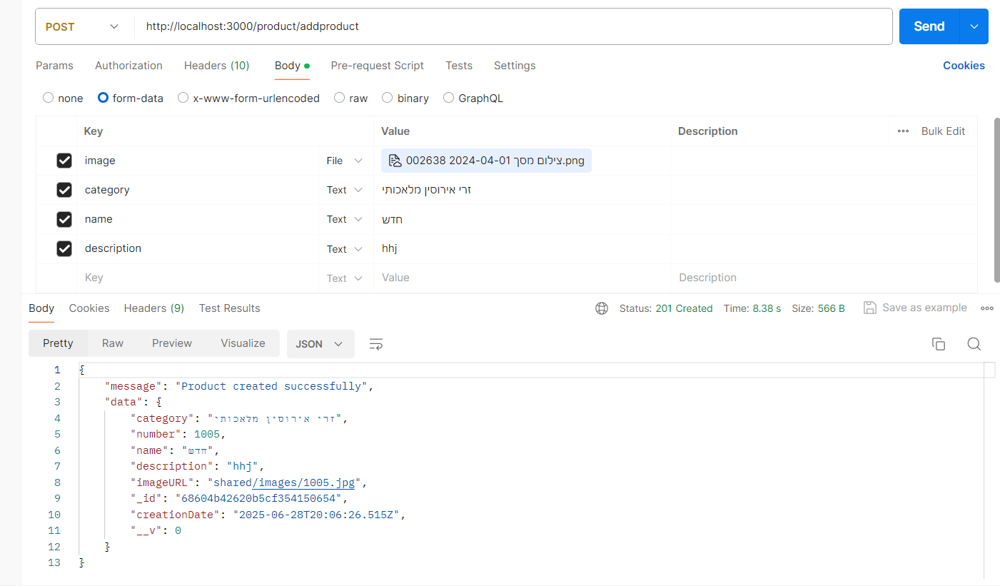

Response 200 / 201 / 400 / 404 / 500:
{
  "data": {  }, /200
  "message": "", /404/500
  "error": "" /500
}

Path:
GET
- product/getproduct/:id (mongo-_id)

Path:
GET
- product/getproductbynumber/:number (int)

Path:
GET
- product/getproductsbycategory/:category (string)

Path:
POST
- product/addproduct
request
{
  body:{ image , category, name, description }
}
const formData = new FormData(e.target);
fetch('/api/recipes', {
  method: 'POST',
  body: formData
});

Path:
POST
- contact/sendemail
request
{
  body:
  { 
    formName,
    message,
    fromEmail
  }
}